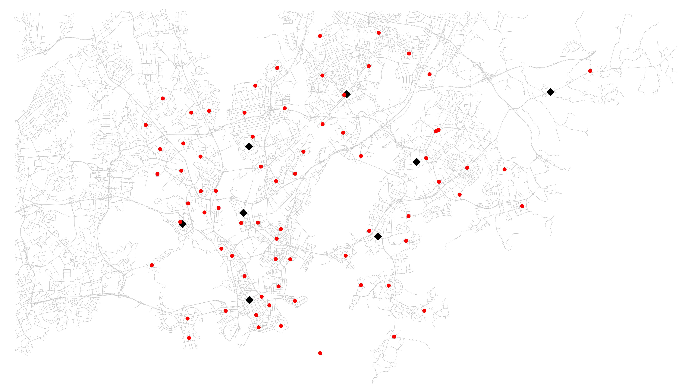
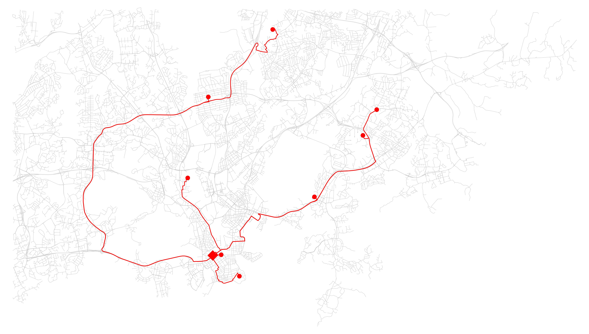
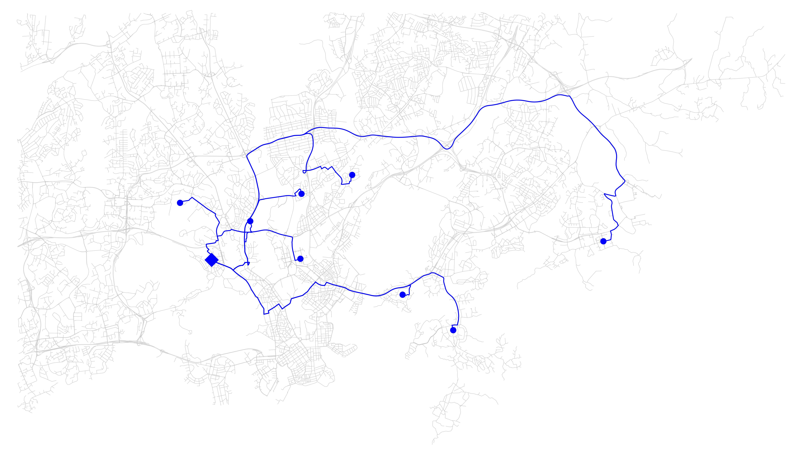
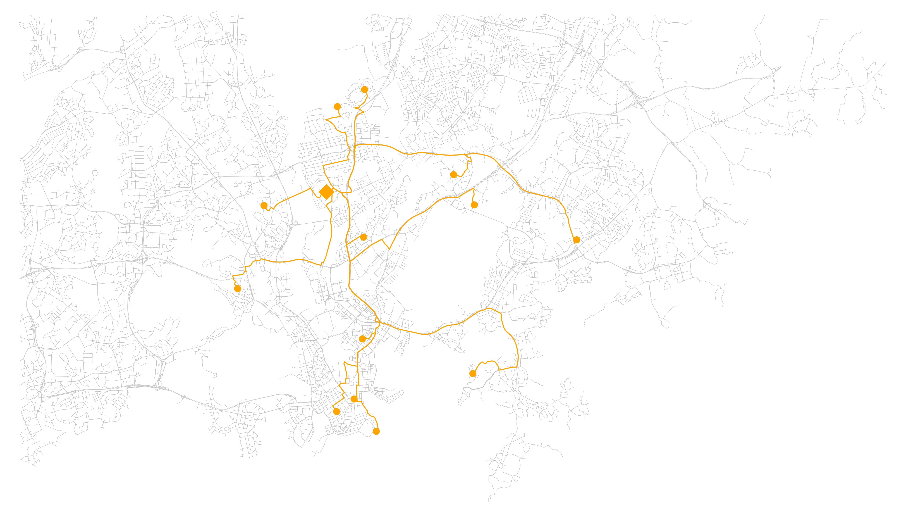

## Initial data 

## Preprocessing

## Euclidean solution

Optimal solution with euclidean distance as cost function.

## Road network solution

Optimal solution with road distances as cost function.

Delivery routes for warehouse 1.

Delivery routes for warehouse 2.

Delivery routes for warehouse 3.

Delivery routes for warehouse 4.

Delivery routes for warehouse 5.

Delivery routes for warehouse 6.

Delivery routes for warehouse 7.

Delivery routes for warehouse 8.

